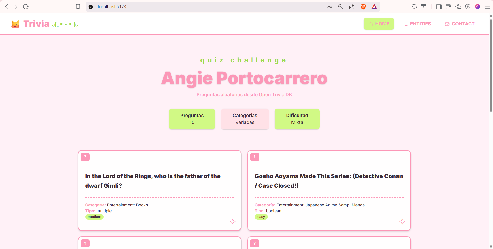
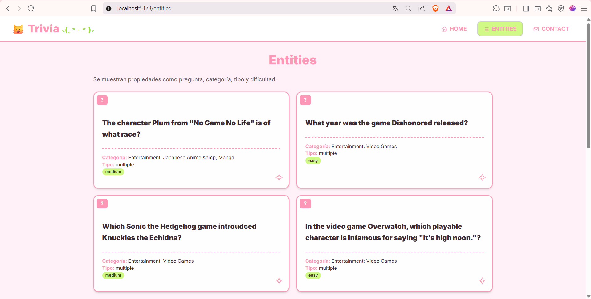
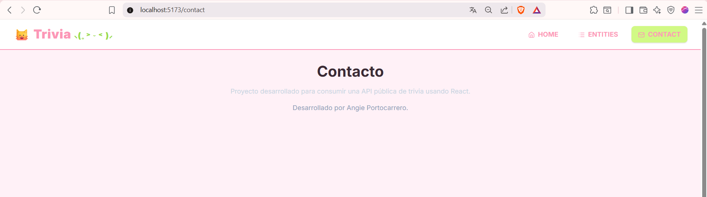
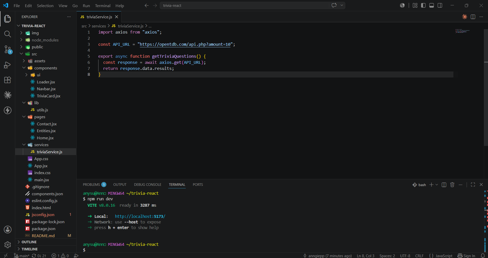
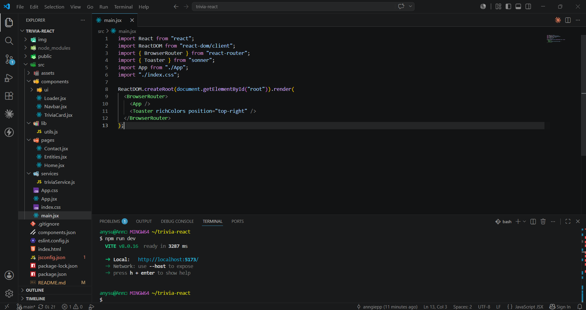
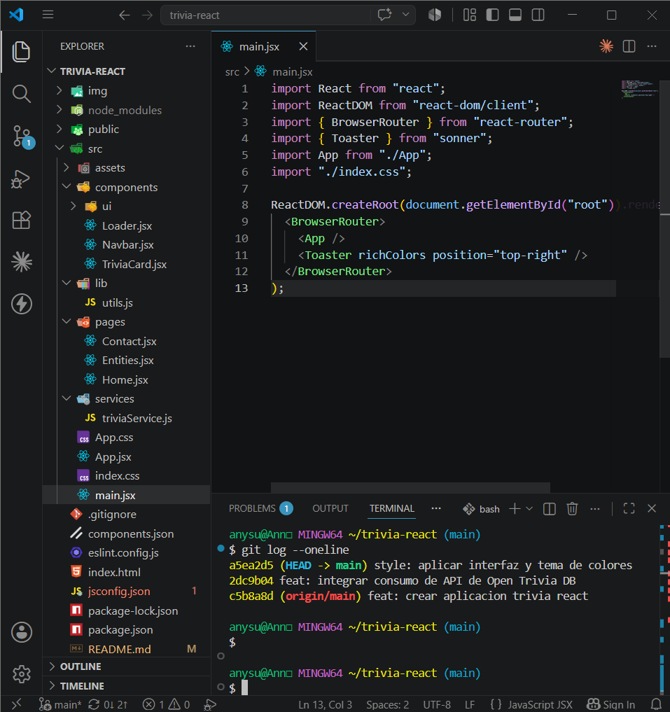

# Trivia React - Quiz

Aplicación SPA desarrollada con **React 19** y **Vite** que consume datos desde la API pública **Open Trivia DB**. El proyecto presenta preguntas de trivia con una interfaz que utiliza colores pastel, componentes modernos y navegación entre rutas.

---

# 📖 Descripción del Proyecto

Trivia React es una aplicación web que obtiene preguntas aleatorias desde una API pública y las muestra mediante una interfaz amigable y visualmente atractiva.

El proyecto fue desarrollado aplicando conceptos fundamentales de React como:

* Componentes reutilizables
* Hooks (`useState`, `useEffect`)
* Navegación con React Router
* Consumo de APIs con Axios
* Renderizado dinámico de datos
* Manejo de estados de carga
* Diseño moderno con Shadcn UI

---

# 🚀 Tecnologías Utilizadas

* React 19
* Vite
* React Router
* Axios
* Tailwind CSS
* Shadcn UI
* Sonner
* Lucide React
* Open Trivia DB API
* Git & GitHub

---

# 📂 Estructura del Proyecto

```text
trivia-react/
│
├── img/
│   ├── home.png
│   ├── entities.png
│   ├── contact.png
│   ├── api-consumption.png
│   ├── project-structure.png
│   ├── commits.png
│   ├── github-repository.png
│   └── deploy.png
│
├── public/
│
├── src/
│   ├── components/
│   │   ├── Loader.jsx
│   │   ├── Navbar.jsx
│   │   └── TriviaCard.jsx
│   │
│   ├── pages/
│   │   ├── Home.jsx
│   │   ├── Entities.jsx
│   │   └── Contact.jsx
│   │
│   ├── services/
│   │   └── triviaService.js
│   │
│   ├── App.jsx
│   └── main.jsx
│
├── package.json
├── vite.config.js
└── README.md
```

---

# 🛠 Instalación y Ejecución

### 1. Clonar el repositorio

```bash
git clone [REPOSITORIO](https://github.com/anngiepp/trivia-react.git)
```

### 2. Ingresar al proyecto

```bash
cd trivia-react
```

### 3. Instalar dependencias

```bash
npm install
```

### 4. Ejecutar el servidor de desarrollo

```bash
npm run dev
```

### 5. Abrir la aplicación

```text
http://localhost:5173
```

---

# 🌐 API Utilizada

La aplicación consume datos desde la API pública:

```text
https://opentdb.com/api.php?amount=10
```

La información obtenida incluye:

* Pregunta
* Categoría
* Tipo
* Dificultad

---

# 📍 Rutas Implementadas

## 🏠 Home (/)

Página principal que contiene:

* Hero principal del proyecto
* Descripción de la aplicación
* Estadísticas rápidas
* Listado de preguntas obtenidas desde la API

### Evidencia



---

## 📜 Entities (/entities)

Muestra las entidades obtenidas desde la API mostrando propiedades como:

* Question
* Category
* Type
* Difficulty

### Evidencia



---

## 📞 Contact (/contact)

Página informativa con información general del proyecto.

### Evidencia



---

# 🔄 Consumo de API

La obtención de datos se realiza mediante Axios utilizando un servicio dedicado.

### Evidencia



---

# 🎨 Diseño de la Interfaz

La aplicación utiliza:

* Shadcn UI
* Tailwind CSS
* Componentes reutilizables
* Paleta de colores inspirada en la estética japonesa alternativa de los años 2000
* Diseño responsive

---

# 📊 Componentes Principales

### Navbar

Permite la navegación entre rutas mediante React Router.

### Loader

Muestra un indicador visual mientras se obtienen datos desde la API.

### TriviaCard

Renderiza cada pregunta con su información correspondiente.

---

# 🧠 Hooks Utilizados

### useState

Permite almacenar:

* Preguntas obtenidas
* Estado de carga

### useEffect

Permite ejecutar automáticamente la petición a la API cuando se carga la página.

---

# 📁 Evidencias del Proyecto

## Estructura del Proyecto



---

## Historial de Commits



---

## Repositorio GitHub


---

# 🚀 Deploy

Aplicación desplegada en:

**URL:**

```text
PEGAR_URL_DE_VERCEL
```

### Evidencia


---

# 🎥 Video Demostrativo

Video de presentación del proyecto:

```text
PEGAR_URL_DEL_VIDEO
```

El video muestra:

* Clonación del repositorio
* Instalación de dependencias
* Ejecución del proyecto
* Navegación entre rutas
* Consumo de la API
* Repositorio GitHub
* Deploy funcional

---

# 👩‍💻 Autor

**Angie Portocarrero**

Proyecto desarrollado como práctica de React utilizando Vite, React Router, Axios y Shadcn UI.
